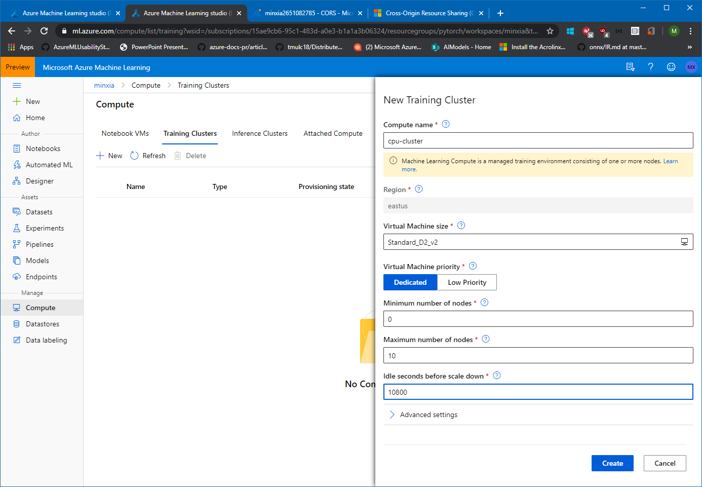
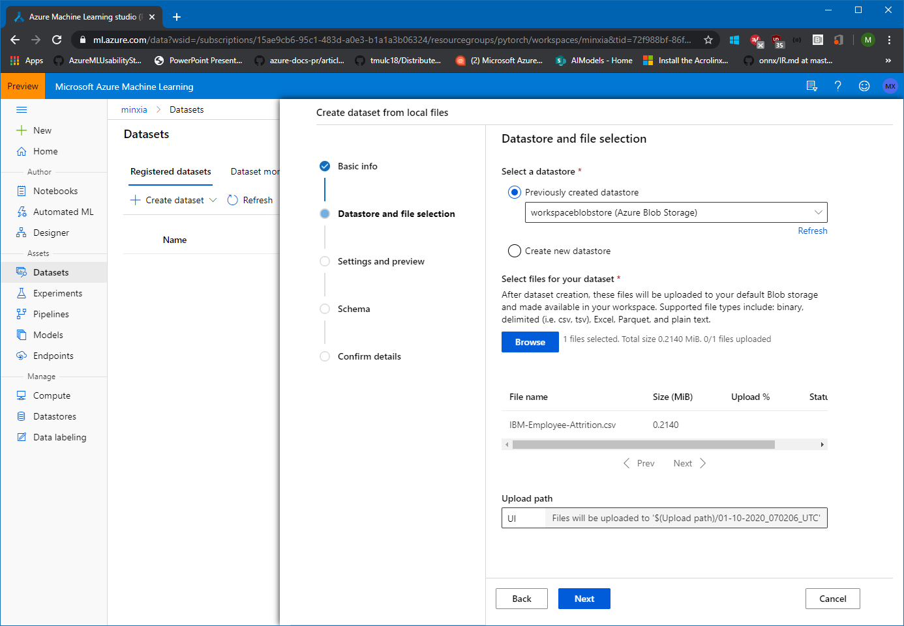

# Automated Machine Learning

Automated machine learning (automated ML) builds high quality machine learning models for you by automating model and hyperparameter selection. Bring a labelled dataset that you want to build a model for, automated ML will give you a high quality machine learning model that you can use for predictions.

If you are new to Data Science, automated ML will help you get jumpstarted by simplifying machine learning model building. It abstracts you from needing to perform model selection, hyperparameter selection and in one step creates a high quality trained model for you to use.

If you are an experienced data scientist, automated ML will help increase your productivity by intelligently performing the model and hyperparameter selection for your training and generates high quality models much quicker than manually specifying several combinations of the parameters and running training jobs. Automated ML provides visibility and access to all the training jobs and the performance characteristics of the models to help you further tune the pipeline if you desire.

To learn more about automated ML, see documentation [here](https://docs.microsoft.com/en-us/azure/machine-learning/service/concept-automated-ml).

Try the sample notebooks [here](https://github.com/Azure/MachineLearningNotebooks/tree/master/how-to-use-azureml/automated-machine-learning).

## Prerequisites
Azure subscription and Azure ML workspace. See instructions on how to create a workspace [here](https://docs.microsoft.com/en-us/azure/machine-learning/service/how-to-manage-workspace).

## Creating an AzureML compute cluster
We will do a number of actions that require a compute target to be exectuted on. We will start by creating a cluster of CPU VMs.

1. Navigate to 'Compute' in the Manage/Compute section and click 'Add' 

1. Call the cluster 'cpu-cluster' and choose the type 'Machine Learning Compute'. 
    - For machine size choose 'Standard_D2_v2' (that is an inexpensive general purpose VM size at about $0.14/hour). 
    - Set the 'minimum number of nodes' to 0 and the  the 'maximum number of nodes' to 10. That way the cluster will scale automatically to up to 10 nodes as jobs require them.
    - Set the 'Idle seconds before scale down' to 7200. That means that nodes will be kept around for 3 hours before they are spun down. That way, during our workshop, jobs won't have to wait for spin-up. Make sure that number is lower if you are using a more expensive VM size.

## Creating an AzureML Notebook VM

Next, we will create a Notebook VM. The Notebook VM will serve as an interactive workstation in the cloud that serves as a Jupyter server, but also hosts and instance of RStudio server and can run TensorBoard, Bokeh, Shiny or other apps used during the developement work of a data scientist.

1. Navigate to 'Notebook VMs' and click on 'New': 

 
1. Choose some sufficiently unique name, keep the default VM type (STANDARD_DS3V2 -- a fairly inexpensive machine type costing about $0.27/hour) and click 'Create':

See [here](https://docs.microsoft.com/en-us/azure/machine-learning/service/how-to-configure-environment#notebookvm) for details on creating AzureML Notebook VMs.

**Note that this machine will keep running until you stop it from the portal.**

## Uploading a Dataset to AzureML studio

1. Download the IBM Attrition dataset by clicking on this link: https://raw.githubusercontent.com/danielsc/azureml-workshop-2019/master/data/IBM-Employee-Attrition.csv and saving the file to disk.

1. Navigate to the left pane of your workspace. Select Datasets under the Assets section. 

1. Click on 'Create dataset' and choose 'From local files'. 

1. Click 'Browse', choose the file you had downloaded and tnen click 'Done' to complete the creation of the new dataset. Make sure to leave the Type set to Tabular.

1. Now, click on the newly created dataset and click 'Explore'. Here you can see the fields of the Tabular dataset.

1. To get more details (in particulare for larger datasets), click 'Generate profile', select the cluster you created and then click 'Generate' to generate profile information for this dataset. This will take little while, since the cluster needs to spin up a node, so we will move to the next task and come back to this later.

## Using Automated Machine Learning

Follow the instructions in the [documentation](https://docs.microsoft.com/en-us/azure/machine-learning/service/how-to-create-portal-experiments) for a full overview of the user interface.

1. Navigate to the left pane of your workspace. Select Automated Machine Learning under the Authoring (Preview) section.
.

1. Enter your experiment name, then select a compute from the list of your existing computes or [create a new compute](https://docs.microsoft.com/en-us/azure/machine-learning/service/how-to-create-portal-experiments#create-an-experiment). 

1. Select a the IBM-Employee-Attrition dataset that you had created above.

1. Preview data and keep all columns selected for training.

1. Select the training job type: **Classification**
1. Select target column: **Attrition**

1. Open “**Advanced settings**”, set the 'Primary metric' to 'AUC_weighted' and training job time to 15 minutes (for the workshop).

1. Hit "**Start**" and wait for the training job to start. You’ll be able to see the models which are created during the run, click on any of the models to open the detailed view of that model, where you can analyze the [graphs and metrics](https://docs.microsoft.com/en-us/azure/machine-learning/service/how-to-understand-automated-ml).

1. Once the run is completed, click **deploy the best model** to create a deployed endpoint from the model.

1. Once deployed, follow [instructions](https://docs.microsoft.com/en-us/power-bi/service-machine-learning-integration) to consume from Power BI.

