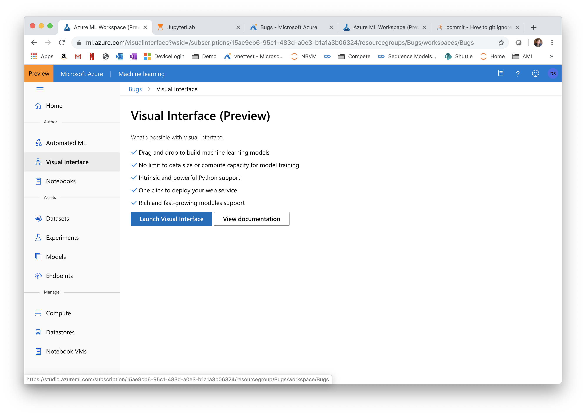
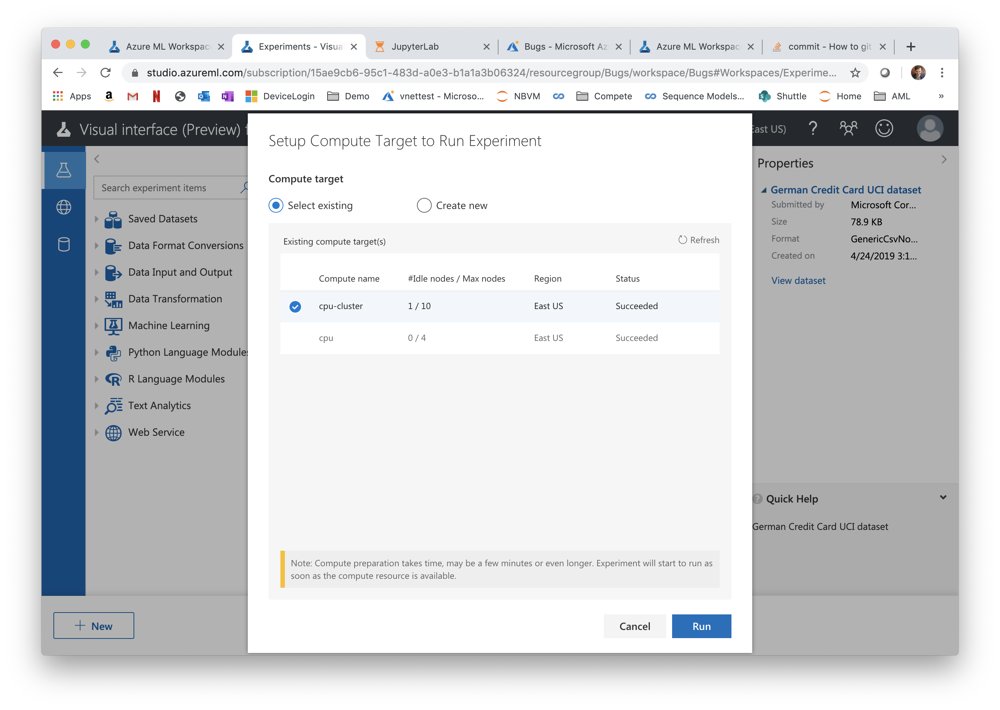
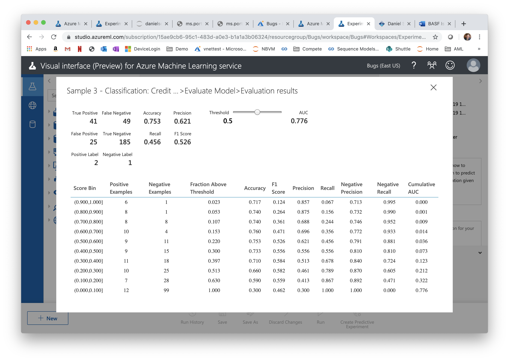

# The AzureML Visual Interface (Preview)

In the AzureML studio, navigate to the Visual Interface (Preview) and launch 

Create a new experiment buy opening Sample 3: Classification: Credit Risk Prediction (Basic)

The graph for the sample experiment will open. You can inspect the properties of each of the steps, but you cannot see any outputs until you ran the experiment. 

Click 'Run' at the bottom. Choose the compute target you had created earlier.

Once you ran the experiment, you can inspect the outputs of the individual steps -- check out the output of the different steps, in particular the last one ('Visualize')

**Optional Task:** Create and run an experiment that trains a model to predict attrition using the IBM Attrition Dataset you had uploaded earlier.
