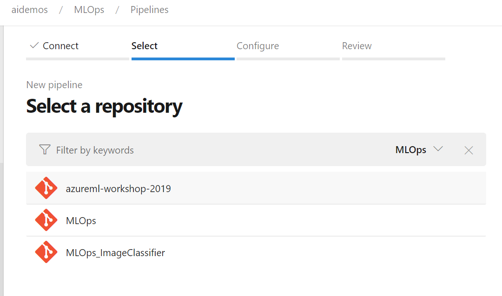
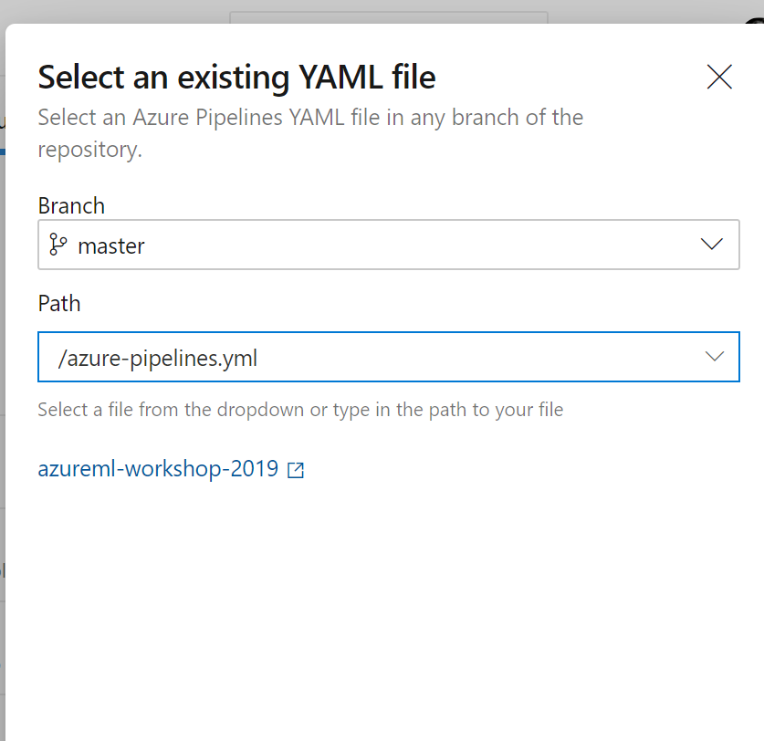
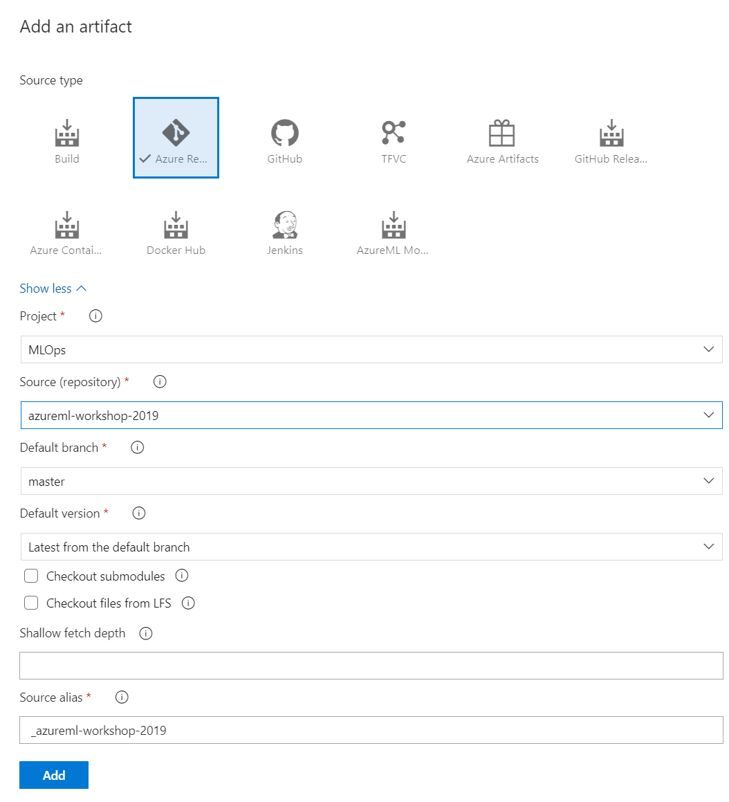
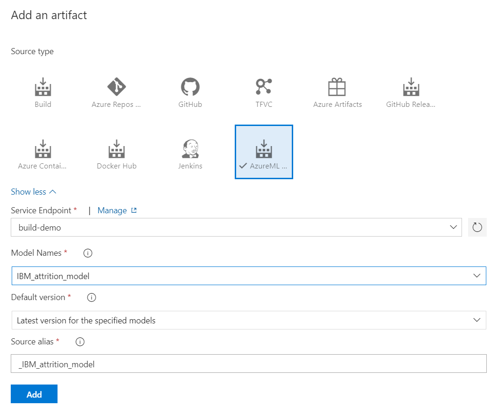
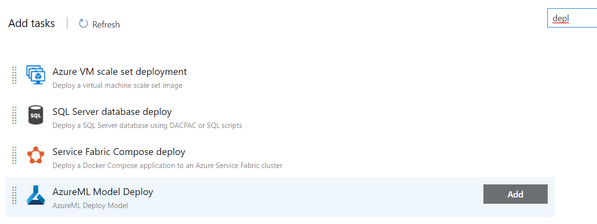
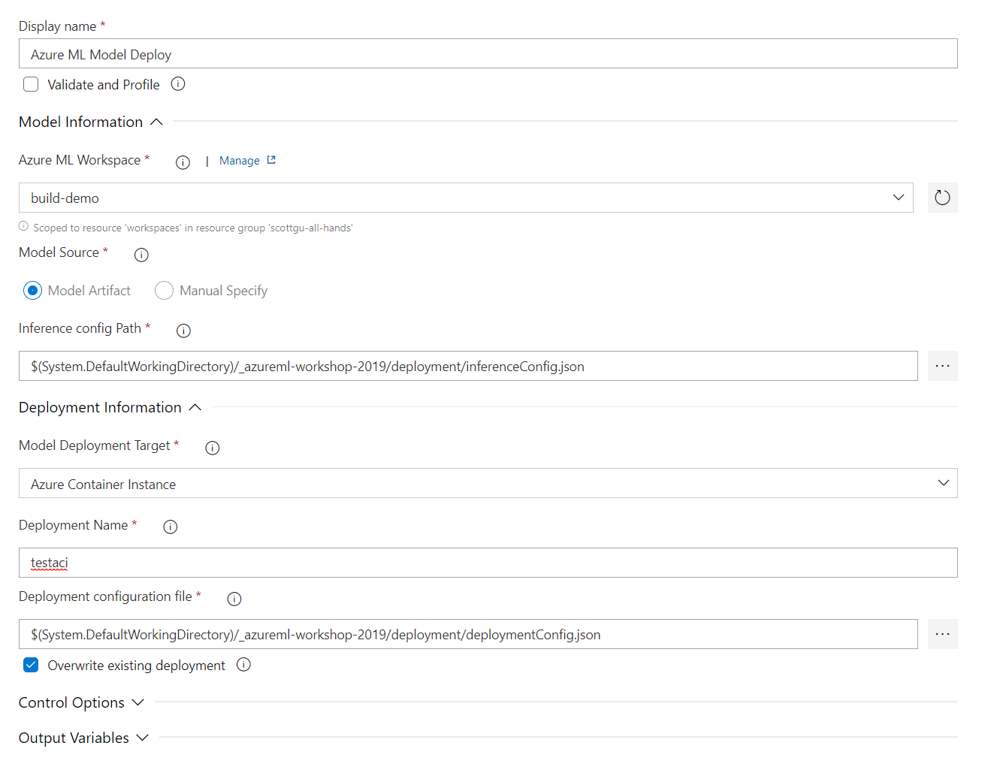
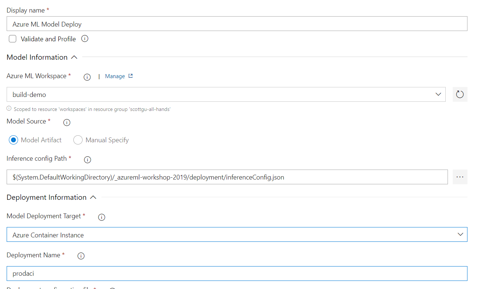
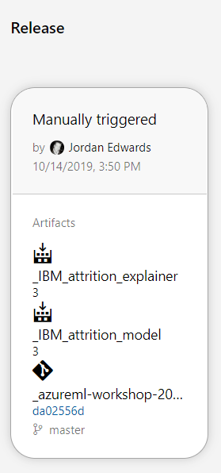
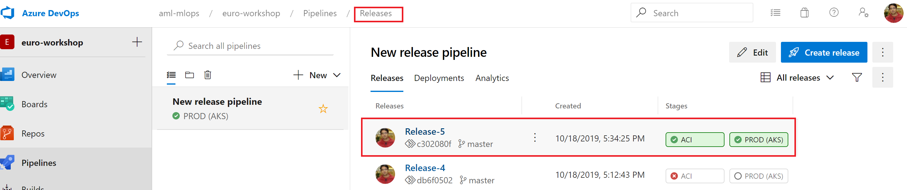

Import the workshop repo to Azure DevOps
========================================
Go to your Azure DevOps project, into the Repos area.
Click on the Git repo dropdown at the top of the page and then on "Import Repository".

Under clone URL, you can put https://github.com/danielsc/azureml-workshop-2019.git

Next, let's connect your ML workspace to Azure DevOps.

Connect your ML workspace to a DevOps project
=============================================


This workshop leverages the **Azure Machine Learning** extension that should be installed in your organization from the [marketplace](https://marketplace.visualstudio.com/items?itemName=ms-air-aiagility.vss-services-azureml).

In order to set up automated training and deployment, you need to create a service connection to your ML workspace. To get there, go to your Azure DevOps project settings page (by clicking on the cog wheel to the bottom left of the screen), and then click on **Service connections** under the **Pipelines** section. The Azure ML extension uses an **Azure Resource Manager** service connection.

**Note:** Creating service connection using Azure Machine Learning extension requires 'Owner' or 'User Access Administrator' permissions on the Workspace.

This is how your service connection looks like. Make sure to pick your resource group and AML workspace.


Automating Training
===================

Before you start please make sure to change the _target_ parameter in 4-mlops/aml_config/train.runconfig file to the AML compute cluster name that you would have created in your AML workspace. This compute cluster will be used by the Azure pipelines to run the jobs.

The first phase of bringing your ML workflow to production is being able
to reproduce and automate the model training process.

Azure Machine Learning provides a technology called Machine Learning
pipelines which enables you to define your training workflow in reusable
steps and publish these steps as a Pipeline Endpoint which can be
triggered to run on demand, on a time-based schedule, or as new data
becomes available.

Create an ML pipeline from a YML file
=====================================

Automation is easier to create and manage when you use a declarative
format such as YML. Here is an example Azure ML pipeline YML file which
turns the same code you ran earlier into a repeatable pipeline:

```
   pipeline:
       name: SamplePipelineForTraining
       steps:
           TrainStep:
               python_script_step:
                   name: "PythonScriptStep"
                   script_name: "train_explain.py"
                   allow_reuse: True
                   source_directory: "."
               runconfig: 'train.runconfig'
               outputs:
                   result:
                       destination: Output
                       datastore: workspaceblobstore
                       type: mount
```

You’ll note this example looks similar to the logic expressed in the
Jupyter notebook, but expressed in an easier to parse and compare
fashion.

To create the ML pipeline, you can run the following command from your
notebook:

**pipeline** = Pipeline.load\_yaml(ws, 'training-pipeline.yml')\
**endpoint** = pipeline.publish('Train IBM Employee Attrition')

Run a Published Pipeline on Demand
==================================

You can run a published pipeline from the SDK / CLI / UI.

Published pipelines can be found in the Endpoints area – click into
Pipeline Endpoints.


Schedule Experiments to Run Whenever Code is Checked in to Git
==============================================================

To set up automatic experiment submission on Git commits, we are going
to use an Azure DevOps pipeline. The MLOps workshop contains a
predefined pipeline to execute your experiment run & publish your
experiment run as a repeatable pipeline.

To create a DevOps pipeline, navigate to the Pipelines area and click
“new pipeline” (top right)


Select your repository & then select “Existing Azure Pipelines YML file”. Note that Azure pipelines are different than the ML pipelines mentioned earlier.






Once this is set up, you can hit “Run” on the pipeline, which will go
execute your experiment.

The DevOps pipeline YML is doing 3 things:

Installing the CLI & attaching to the ML workspace\
'az ml folder attach -w build-2019-demo -g scottgu-all-hands'

Attach caches the workspace info in a file so you don't have to keep adding the -w -g parameters to the ML commands.

Publishing your ML experiment as a reusable pipeline.\
As mentioned above this _ML pipeline_ can be triggered to run on demand, on a time-based schedule, or as new data becomes available.

'az ml pipeline create --name trainattrition -y
training-ml-pipeline.yml'

Executing your ML experiment as a script run.

This makes sure whenever any checkin happens a build is triggered that submits a run

'az ml run submit-script -c train -e test train\_explain.py'


Automating Deployment
=====================

Model deployment is typically configured to create a pipeline which
enables models to make predictions in real-time or in batch.

In this walkthrough, we will show you how to leverage Azure Machine
Learning + Azure DevOps to deploy a model as a REST API for real time inference.

Create new release pipeline
===========================

Go to the new **Releases Pipelines** section, and click new to create a new release pipeline. A first stage is automatically created and choose **start with an Empty job**. Name the stage **QA (ACI)** and add a single task to the job **Azure ML Model Deploy**. Make sure that the Agent Specification is ubuntu-16.04 under the Agent Job: 


Add code artifact
=================

Click on __Add an artifact__ and pick the code artifact as shown in the screenshot below:



Add model artifact
==================

Click on __Add an artifact__ and this time pick __AzureML Model Artifact__. This will connect to your AML workspace and pick up the registered model



Add deploy task
===============

Now we will pick up the deploy task. Search for __AzureML Model Deploy__ on the _Add tasks_ screen as shown below:



Configure deploy task
=====================

Configure the deploy task as shown in the screenshot below.



Clone to PROD stage
===================

As shown in the screenshot below you can clone the existing QA stage and create a PROD stage. For prod stage you can pre-deployment approvals so that deployment only gets triggered when someone approves it.


Configure gates
===============


Change name of PROD service
==================

Make sure you do not override your existing QA service. Note that recommended way is to use AKS for your production service but due to time limitation in the workshop we will use ACI for production deployment as well.



Create release!
===============

Click on __Create Release__ on the top right. This is how the final pipeline looks like:



Monitor release progress
===============

You can monitor release progress by clicking on release and then clicking on the specific release as shown below:


