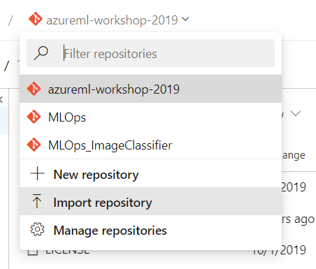
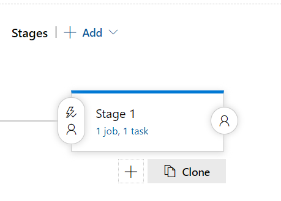

Git repo:
<https://aidemos.visualstudio.com/MLOps/_git/azureml-workshop-2019?path=%2Fazure-pipelines.yml&version=GBmaster>\
CI pipeline:
<https://aidemos.visualstudio.com/MLOps/_build?definitionId=121&_a=summary>

CD pipeline:
<https://aidemos.visualstudio.com/MLOps/_release?_a=releases&view=mine&definitionId=4>

Automating Training
===================

The first phase of bringing your ML workflow to production is being able
to reproduce and automate the model training process.

Azure Machine Learning provides a technology called Machine Learning
pipelines which enables you to define your training workflow in reusable
steps and publish these steps as a Pipeline Endpoint which can be
triggered to run on demand, on a time-based schedule, or as new data
becomes available.

Create an ML pipeline from a YML file
=====================================

Automation is easier to create and manage when you use a declarative
format such as YML. Here is an example Azure ML pipeline YML file which
turns the same code you ran earlier into a repeatable pipeline:

pipeline:

name: SamplePipelineForTraining

default\_compute: cpu

steps:

TrainStep:

python\_script\_step:

name: "PythonScriptStep"

script\_name: "train\_explain.py"

allow\_reuse: True

source\_directory: "."

runconfig: 'train.runconfig'

outputs:

result:

destination: Output

datastore: workspaceblobstore

type: mount

You’ll note this example looks similar to the logic expressed in the
Jupyter notebook, but expressed in an easier to parse and compare
fashion.

To create the ML pipeline, you can run the following command from your
notebook:

**pipeline** = Pipeline.load\_yaml(ws, 'training-pipeline.yml')\
**endpoint** = pipeline.publish('Train IBM Employee Attrition')

Run a Published Pipeline on Demand
==================================

You can run a published pipeline from the SDK / CLI / UI.

Published pipelines can be found in the Endpoints area – click into
Pipeline Endpoints.

{width="6.5in"
height="5.436804461942257in"}exp

Schedule Experiments to Run Whenever Code is Checked in to Git
==============================================================

To set up automatic experiment submission on Git commits, we are going
to use an Azure DevOps pipeline. The MLOps workshop contains a
predefined pipeline to execute your experiment run & publish your
experiment run as a repeatable pipeline.

To create a DevOps pipeline, navigate to the Pipelines area and click
“new pipeline” (top right)

{width="6.5in" height="3.0083333333333333in"}

Select your repository & then select “Existing Azure Pipelines YML file”

{width="4.072319553805774in"
height="2.405540244969379in"}

{width="4.0in" height="2.977350174978128in"}

{width="3.371811023622047in"
height="3.270945975503062in"}

Once this is set up, you can hit “Run” on the pipeline, which will go
execute your experiment.

The DevOps pipeline YML is doing 3 things:

Installing the CLI & attaching to the ML workspace\
'az ml folder attach -w build-2019-demo -g scottgu-all-hands'

Executing your ML experiment as a script run.\
'az ml run submit-script -c train -e test train\_explain.py'

Publishing your ML experiment as a reusable pipeline.\
'az ml pipeline create --name trainattrition -y
training-ml-pipeline.yml'

Automating Deployment
=====================

Model deployment is typically configured to create a pipeline which
enables models to make predictions in real-time or in batch.

In this walkthrough, we will show you how to leverage Azure Machine
Learning + Azure DevOps to deploy a model as a REST API.

Import github repo
==================

{width="4.708990594925634in" height="4.010976596675415in"}
=====================================================================================

Create new release pipeline
===========================

{width="5.0739501312335955in"
height="1.9791666666666667in"}

Add code artifact
=================

{width="4.756898512685915in"
height="5.230555555555555in"}

Add model artifact
==================

{width="4.537798556430446in"
height="3.7708333333333335in"}

Add deploy task
===============

{width="6.5in" height="2.441666666666667in"}

Configure deploy task
=====================

{width="6.5in"
height="5.0055555555555555in"}

Clone to PROD stage
===================

{width="4.781917104111986in"
height="3.427561242344707in"}

Configure gates
===============

{width="6.5in" height="4.752777777777778in"}

Change name of PROD service
===========================

{width="6.5in" height="3.857638888888889in"}

Create release!
===============

{width="2.906655730533683in"
height="6.209199475065617in"}
